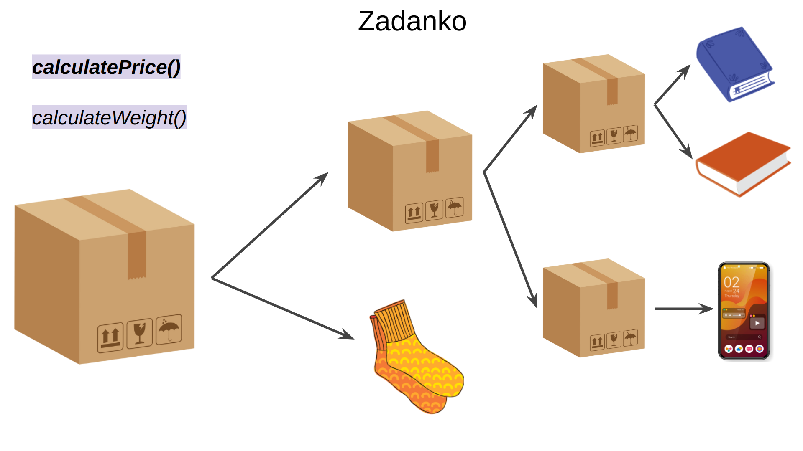

# Zarządzanie wysyłką

## Opis

System ma za zadanie obliczać wagę i cenę paczki, co pomaga dobrać odpowiedni środek transportu dla danej paczki.
Paczka może bezpośrednio zawierać produkty oraz może zawierać inne paczki, które z kolei zawierają produkty lub inne paczki.
Struktura przesyłek przypomina drzewo, jak pokazano na rysunku poniżej.

Aktualna implementacja nie spełnia tych wymagań, ponieważ [Box](Box.java) może zawierać tylko listę [Product](Product.java), a powinien również mieć możliwość zawierania innych [Box](Box.java).

## Zadanie

Twoim zadaniem jest zaimplementowanie tego rozwiązania w taki sposób, aby nie było konieczności jawnego iterowania po wszystkich produktach i paczkach w celu wykonania obliczeń dla ceny i wagi całej przesyłki.
System musi być elastyczny, ponieważ w przyszłości możliwe jest dodanie kolejnych rodzajów opakowań, które również będą musiały być obsługiwane w ten sam sposób.
Do rozwiązania tego problemu użyj wzorca Kompozyt. 😄
Dla [DeliveryService](DeliveryService.java) nie ma różnicy między [Box](Box.java) a [Product](Product.java), ponieważ oba posiadają cenę i wagę, więc w tym kontekście powinny być traktowane tak samo.

### Warunki akceptacji

Implementacja będzie uznana za prawidłową, jeśli testy akceptacyjne będą zielone.
W testach została już wymuszona oczekiwana struktura, dlatego obecnie nawet się nie kompilują.
- [DeliveryServiceTest](../../../../test/java/wzorce/composite/DeliveryServiceTest.java)

Możesz modyfikować wszystkie klasy, aby osiągnąć wyznaczony cel, z wyjątkiem klasy testowej. 😊