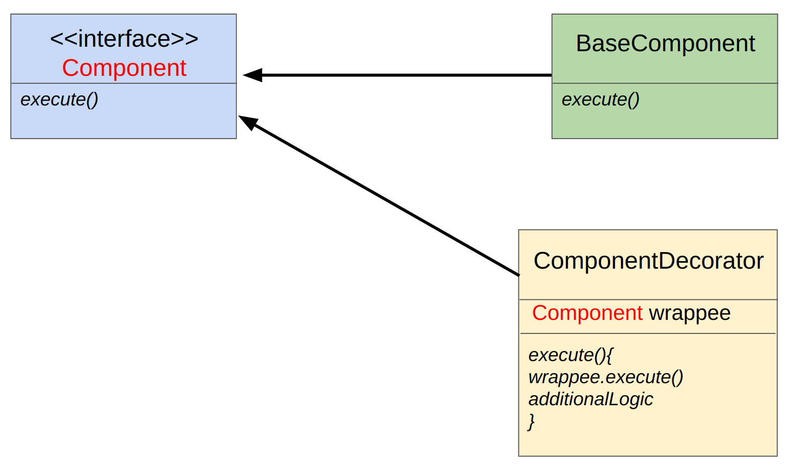

# Zarządzanie Rozliczeniami Przejazdów

## Opis

System ma za zadanie obliczać koszt przejazdu w zależności od taryfy.
Jednocześnie może istnieć wiele taryf, w których obowiązywał przejazd, ale zawsze istnieje jedna bazowa taryfa. Do niej mogą być dodawane kolejne taryfy takie jak:
- **FRIDAY**
- **HAPPY_HOURS**
- **NEW_YEARS_EVE**.

Czy taryfy zostaną dołączone, czy nie, zależy od czasu zarejestrowania przejazdu (taryfa **FRIDAY** będzie dołączona tylko w piątek :D) .

Podczas rozwoju naszej aplikacji napotkaliśmy problem, polegający na tym, że każda nowa taryfa wymagała tworzenia wielu klas, 
ze względu na możliwość jednoczesnego stosowania wielu taryf. 
Biznes chciałby dodać kilka dodatkowych taryf, na przykład zniżkę dla przejazdów za-requestowanych dokładnie o pełnej godzinie. 
Dodanie kolejnej taryfy spowodowałoby konieczność stworzenia 8 dodatkowych klas, a każda kolejna taryfa mnożyłaby tę liczbę. 
Ta podejście musi zostać zmienione!

Informacyjnie (nie do implementacji)

Dla kolejnej taryfy w tym podejściu powstałyby następujące klasy (wylistowane dla przejrzystości):

1. ExactHourTariff
2. FridayExactHourTariff
3. HappyHoursExactHourTariff
4. NewYearsEveExactHourTariff
5. FridayHappyHoursExactHourTariff
6. FridayNewYearsEveExactHourTariff
7. HappyHoursNewYearsEveExactHourTariff
8. FridayHappyHoursNewYearsEveExactHourTariff

## Zadanie

Twoim zadaniem jest użycie wzorca dekorator, aby nie zmieniło się aktualne zachowanie aplikacji, ale otworzyła się furtka na łatwe dodawanie nowych taryf.

### Warunki akceptacji

Testy [TransitServiceTest](../../../../test/java/wzorce/decorator/TransitServiceTest.java) powinny pozostać zielone po twoich zmianach.

### Info
Oto jak wygląda podstawowa relacja między klasami dla wzorca Dekorator:

