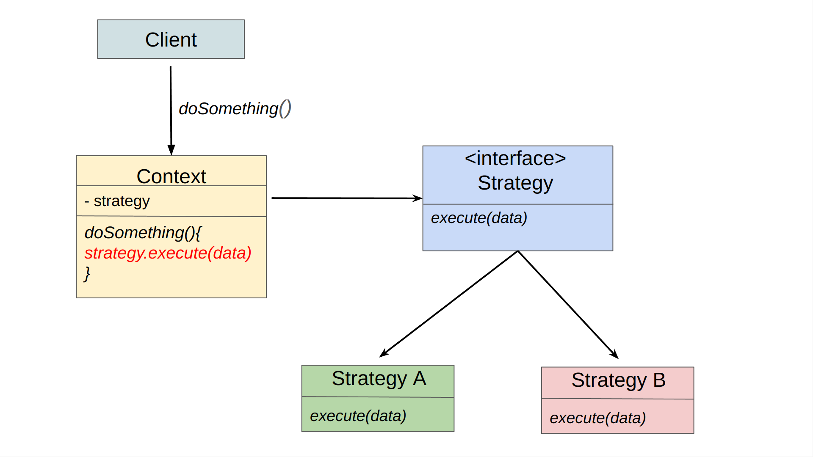

## Opis

System ma możliwość wysyłania wiadomości do klientów za pomocą trzech kanałów: 
- EMAIL
- SMS
- PUSH_NOTIFICATION

Liczba kanałów w przyszłości może się zwiększyć.
Wiadomość powinna zostać wysłana do klienta wyłącznie za pośrednictwem jednego kanału, który został określony w jego preferencjach.
Aktualnie jest to rozwiązane tak, że klasa [CustomerNotificationService](CustomerNotificationService.java) jest ściśle powiązana ze wszystkimi senderami dla tych wiadomości.
Ze względu na to, że obiekty odpowiedzialne za wysyłkę nie przechowują stanu, nie ma potrzeby tworzenia ich za każdym razem od nowa, dlatego mogą być singletonami (domyślnie bean w Spring jest singletonem).

## Zadanie

Twoim zadaniem jest użycie wzorca strategii, aby zarządzać wysyłaniem notyfikacji za pomocą różnych kanałów w sposób dynamiczny. 

Po wykonaniu tego zadania obserwowalne zachowania aplikacji nie powinny się zmienić, ale powinna zostać otworzona furtka na łatwe dodawanie nowych typów kanałów i odseparowanie od siebie logiki.

### Warunki akceptacji

Implementacja będzie uznana za prawidłową, jeśli test będą zielone: 
- [SendCustomerNotificationTest](../../../../test/java/wzorce/strategy/SendCustomerNotificationTest.java)

### Info
Oto jak wygląda podstawowa relacja między klasami dla wzorca Strategia:

